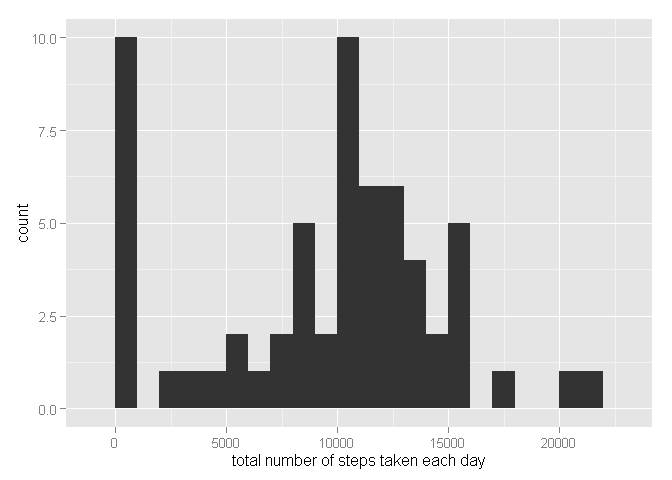
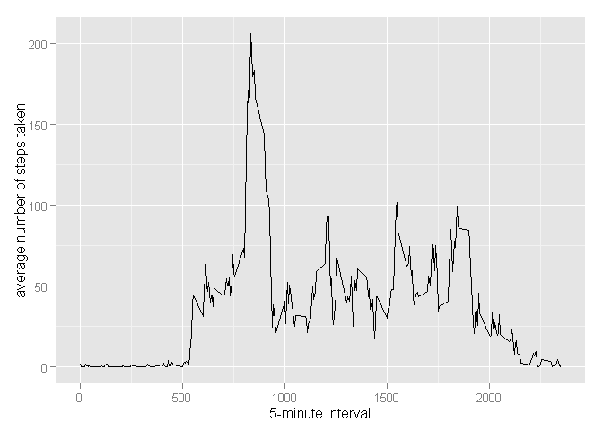
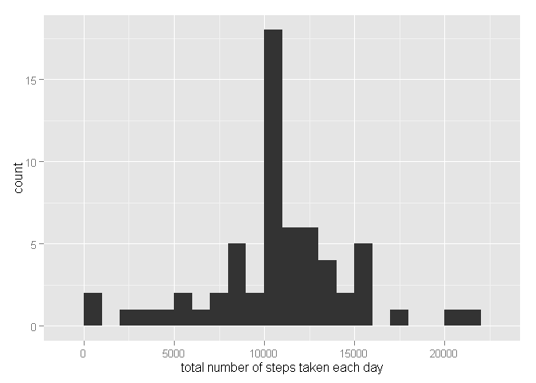
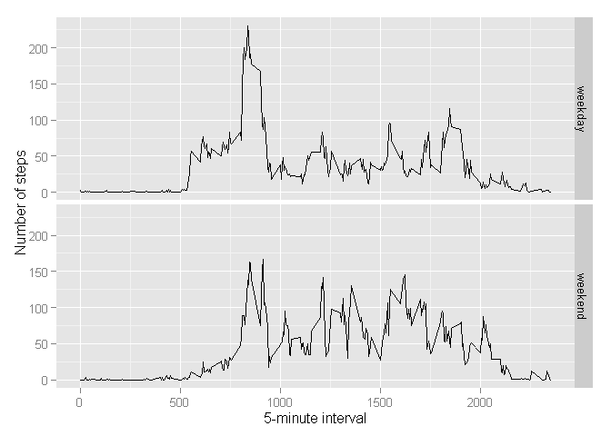

# Reproducible Research: Peer Assessment 1

## Loading and preprocessing the data

Here we load the data from a zip file that is already in the working directory.


```r
unzip(zipfile="repdata-data-activity.zip")
df <- read.csv("activity.csv")
```

## What is mean total number of steps taken per day?

Here we calculate and report the mean and median of the total number of steps taken per day ignoring missing values in the dataset and make a histogram of the total number of steps taken each day


```r
library(ggplot2)
```

```
## Warning: package 'ggplot2' was built under R version 3.2.2
```

```r
total.steps <- tapply(df$steps, df$date, FUN=sum, na.rm=TRUE)
qplot(total.steps, binwidth=1000, xlab="total number of steps taken each day")
```

 

```r
mean(total.steps, na.rm=TRUE)
```

```
## [1] 9354.23
```

```r
median(total.steps, na.rm=TRUE)
```

```
## [1] 10395
```

## What is the average daily activity pattern?

Here we make a time series plot (i.e. type = "l") of the 5-minute interval (x-axis) and the average number of steps taken, averaged across all days (y-axis)


```r
library(ggplot2)
steps.avgs <- aggregate(x=list(steps=df$steps), by=list(interval=df$interval),
                      FUN=mean, na.rm=TRUE)
ggplot(data=steps.avgs, aes(x=interval, y=steps)) +
    geom_line() +
    xlab("5-minute interval") +
    ylab("average number of steps taken")
```

 

Here we calculate Which 5-minute interval, on average across all the days in the dataset, contains the maximum number of steps?


```r
steps.avgs[which.max(steps.avgs$steps),]
```

```
##     interval    steps
## 104      835 206.1698
```

## Imputing missing values

There are a number of days/intervals where there are missing values (coded as NA). The presence of missing days may introduce bias into some calculations or summaries of the data.


```r
missing <- is.na(df$steps)

table(missing)
```

```
## missing
## FALSE  TRUE 
## 15264  2304
```

Our strategy for filling in all of the missing values in the dataset uses the mean/value for that 5-minute interval.


```r
fill.value <- function(steps, interval) {
    filled <- NA
    if (!is.na(steps))
        filled <- c(steps)
    else
        filled <- (steps.avgs[steps.avgs$interval==interval, "steps"])
    return(filled)
}
filled.df <- df
filled.df$steps <- mapply(fill.value, filled.df$steps, filled.df$interval)
```
Here we make a histogram using qplot of the total number of steps taken each day and calculate and report the mean and median total number of steps taken per day.


```r
total.steps <- tapply(filled.df$steps, filled.df$date, FUN=sum)
qplot(total.steps, binwidth=1000, xlab="total number of steps taken each day")
```

 

```r
mean(total.steps)
```

```
## [1] 10766.19
```

```r
median(total.steps)
```

```
## [1] 10766.19
```

We can see that means and medians are higher after imputing missing data because in the raw data, there are some days with "steps" values ="NA". and total number of steps for such days had set to 0 by default. After replacing  "steps"="NA" with the mean of "steps" for the relative 5 minute interval
of associated `interval` value, the zero values all increase.

## Are there differences in activity patterns between weekdays and weekends?

Here we use the dataset with the filled-in missing values and create a new factor variable in the dataset with two levels - "weekday" and "weekend" indicating whether a given date is a weekday or weekend day.


```r
weekday.or.weekend <- function(date) {
    day <- weekdays(date)
    if (day %in% c("Monday", "Tuesday", "Wednesday", "Thursday", "Friday"))
        return("weekday")
    else if (day %in% c("Saturday", "Sunday"))
        return("weekend")
    else
        stop("invalid date")
}
filled.df$date <- as.Date(filled.df$date)
filled.df$day <- sapply(filled.df$date, FUN=weekday.or.weekend)
```
Here we wake a panel plot containing a time series plot of the 5-minute interval (x-axis) and the average number of steps taken, averaged across all weekday days or weekend days (y-axis).

```r
steps.avgs <- aggregate(steps ~ interval + day, data=filled.df, mean)
ggplot(steps.avgs, aes(interval, steps)) + geom_line() + facet_grid(day ~ .) +
    xlab("5-minute interval") + ylab("Number of steps")
```

 
